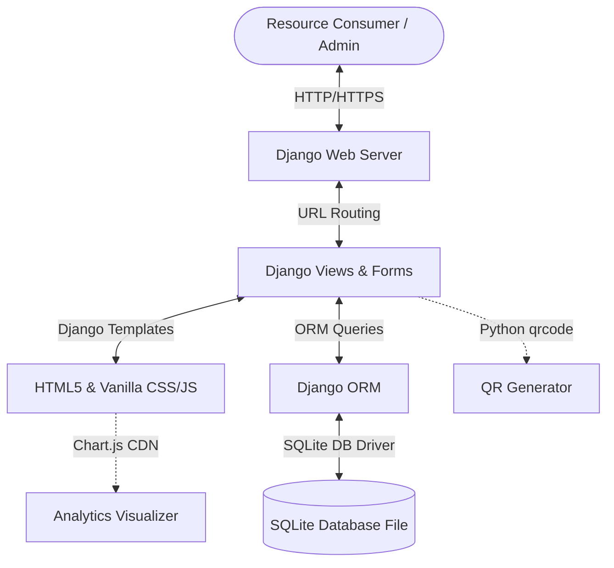

# Smart Asset Management & Resource Allocation Platform (SAMRAP)
## Technical Specification Document (Django Version)

---

## 1. System Architecture
SAMRAP is designed as a monolithic full-stack Django application. We utilize **Django** because of its robust batteries-included architecture: built-in admin panel, secure session management, object-relational mapping (ORM), and template engine.



---

## 2. Technology Stack

### 2.1 Core Frameworks & Runtime
*   **Language:** Python (v3.10+) — Strict type-hinting in views and model layers.
*   **Backend & Frontend Framework:** Django (v5.0+ or v4.2 LTS) — Built using Class-Based Views (CBVs), Django Forms, and Session-based Authentication.
*   **Database Engine:** SQLite — Contained in `db.sqlite3` in the workspace directory. Ideal for rapid prototyping and fully featured with transaction isolation.

### 2.2 Styling & UX
*   **Styling System:** Vanilla CSS — Organized via Django static assets (`static/css/styles.css`, `static/css/components/`). Utilizes custom CSS variables to establish the premium dark theme.
*   **Icons:** FontAwesome or Lucide Icons (loaded via lightweight SVG embedding or CDN).
*   **Typography:** Google Fonts (Inter / Outfit) linked in base HTML templates.
*   **JavaScript:** Vanilla ES6+ JS for interactions, modals, and dynamic data fetching.

### 2.3 Database ORM
*   **ORM:** Django ORM.
*   **Concurrency Control:** `select_for_update()` in database transactions (`transaction.atomic()`) when saving booking instances to lock inventory and prevent race conditions.

### 2.4 Additional Libraries
*   **Charts & Graphs:** Chart.js via CDN (or local copy) — Standard, responsive HTML5 canvas-based chart library.
*   **QR Code Handling:** `qrcode` Python package to generate SVG QR codes directly in Django views.
*   **Authentication & Hashing:** Django's built-in `PBKDF2` hashing password hasher.
*   **Deployment:** Docker & Docker Compose with Gunicorn.

---

## 3. Database Schema Design (Django Models)

The database schema maps directly to Django models:

### 3.1 Custom User Model
We extend Django's default user model to incorporate the custom role hierarchy.
```python
from django.contrib.auth.models import AbstractUser
from django.db import models

class User(AbstractUser):
    class Role(models.TextChoices):
        ADMIN = 'ADMIN', 'Admin'
        USER = 'USER', 'User'
        
    role = models.CharField(
        max_length=10,
        choices=Role.choices,
        default=Role.USER
    )
```

### 3.2 Category Model
```python
class Category(models.Model):
    name = models.CharField(max_length=100, unique=True)
    description = models.TextField(blank=True, null=True)
    created_at = models.DateTimeField(auto_now_add=True)

    def __str__(self):
        return self.name
```

### 3.3 Asset Model
```python
class Asset(models.Model):
    class Status(models.TextChoices):
        READY = 'READY', 'Ready'
        MAINTENANCE = 'MAINTENANCE', 'In Maintenance'
        DAMAGED = 'DAMAGED', 'Damaged'
        RETIRED = 'RETIRED', 'Retired'

    name = models.CharField(max_length=200)
    description = models.TextField(blank=True, null=True)
    category = models.ForeignKey(Category, on_delete=models.CASCADE, related_name='assets')
    total_qty = models.PositiveIntegerField(default=1)
    status = models.CharField(
        max_length=20,
        choices=Status.choices,
        default=Status.READY
    )
    qr_code_url = models.TextField(blank=True, null=True) # Base64 SVG or static path
    created_at = models.DateTimeField(auto_now_add=True)
    updated_at = models.DateTimeField(auto_now=True)
```

### 3.4 Booking Model
```python
class Booking(models.Model):
    class Status(models.TextChoices):
        PENDING = 'PENDING', 'Pending'
        APPROVED = 'APPROVED', 'Approved'
        REJECTED = 'REJECTED', 'Rejected'
        CANCELLED = 'CANCELLED', 'Cancelled'
        ISSUED = 'ISSUED', 'Issued'
        RETURNED = 'RETURNED', 'Returned'

    user = models.ForeignKey(User, on_delete=models.CASCADE, related_name='bookings')
    asset = models.ForeignKey(Asset, on_delete=models.CASCADE, related_name='bookings')
    quantity = models.PositiveIntegerField(default=1)
    start_date = models.DateTimeField()
    end_date = models.DateTimeField()
    status = models.CharField(
        max_length=20,
        choices=Status.choices,
        default=Status.PENDING
    )
    admin_comment = models.TextField(blank=True, null=True)
    issued_at = models.DateTimeField(blank=True, null=True)
    returned_at = models.DateTimeField(blank=True, null=True)
    created_at = models.DateTimeField(auto_now_add=True)
    updated_at = models.DateTimeField(auto_now=True)
```

### 3.5 AssetHealth Model
```python
class AssetHealth(models.Model):
    asset = models.ForeignKey(Asset, on_delete=models.CASCADE, related_name='health_history')
    condition = models.CharField(max_length=100) # e.g. "Good", "Fair", "Damaged", "Unusable"
    notes = models.TextField(blank=True, null=True)
    created_at = models.DateTimeField(auto_now_add=True)
```

### 3.6 AuditLog Model
```python
class AuditLog(models.Model):
    user = models.ForeignKey(User, on_delete=models.SET_NULL, null=True, blank=True)
    action = models.CharField(max_length=100) # e.g. "ASSET_CREATE", "BOOKING_APPROVE"
    details = models.TextField() # JSON serialized modifications
    created_at = models.DateTimeField(auto_now_add=True)
```

---

## 4. URL Endpoints Map

SAMRAP routes will map to standard Django views:

| View Pattern | Name | Access | Description |
| :--- | :--- | :--- | :--- |
| `/accounts/register/` | `register` | Public | Register new user. |
| `/accounts/login/` | `login` | Public | Login view. |
| `/accounts/logout/` | `logout` | Authenticated | Logout view. |
| `/` | `dashboard` | Authenticated | Redirects depending on user role (Admin vs Consumer). |
| `/assets/` | `asset_list` | Authenticated | Browse, search, filter available assets. |
| `/assets/add/` | `asset_add` | Admin | Create new asset. |
| `/assets/<pk>/edit/` | `asset_edit` | Admin | Edit asset details. |
| `/assets/<pk>/delete/` | `asset_delete` | Admin | Delete asset. |
| `/bookings/request/` | `booking_request` | User | Submit booking request. Checks overlaps. |
| `/bookings/` | `booking_list` | Authenticated | List bookings (User sees own, Admin sees all). |
| `/bookings/<pk>/action/` | `booking_action` | Admin | Approve, reject, issue, or return a booking. |
| `/analytics/` | `analytics` | Admin | Renders Chart.js visuals of inventory health and utilization. |
| `/audit-logs/` | `audit_logs` | Admin | View action logs. |

---

## 5. Overlap Booking Check Algorithm (Django Implementation)
To prevent double-bookings, when a new booking is requested:
1.  Wrap the view logic in a transaction block: `@transaction.atomic`.
2.  Lock the asset row for update:
    ```python
    asset = Asset.objects.select_for_update().get(id=asset_id)
    ```
3.  Query active bookings that overlap with requested range `[start_date, end_date]`:
    ```python
    overlapping_bookings = Booking.objects.filter(
        asset=asset,
        status__in=['APPROVED', 'ISSUED'],
        start_date__lte=requested_end_date,
        end_date__gte=requested_start_date
    )
    ```
4.  Compute the maximum concurrent quantity allocated at any point in the requested timeline. (Done by building a timeline of start events (+qty) and end events (-qty), sorting them, and computing running total).
5.  If `max_allocated + requested_quantity > asset.total_qty`, raise a validation error and rollback the transaction.
6.  Else, save the booking.

---

## 6. Dockerization Setup

### 6.1 `Dockerfile`
```dockerfile
FROM python:3.10-slim

ENV PYTHONDONTWRITEBYTECODE=1
ENV PYTHONUNBUFFERED=1

WORKDIR /app

RUN apt-get update && apt-get install -y \
    build-essential \
    libpq-dev \
    && rm -rf /var/lib/apt/lists/*

COPY requirements.txt /app/
RUN pip install --no-cache-dir -r requirements.txt

COPY . /app/

RUN python manage.py collectstatic --noinput

EXPOSE 8000

CMD ["gunicorn", "samrap.wsgi:application", "--bind", "0.0.0.0:8000"]
```

### 6.2 `docker-compose.yml`
```yaml
version: '3.8'
services:
  web:
    build: .
    ports:
      - "8000:8000"
    volumes:
      - .:/app
    environment:
      - SECRET_KEY=django-super-secret-key-12345
      - DEBUG=True
    restart: always
```
